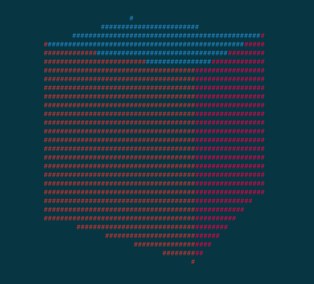

# Term3D
A game engine for making 3D games in the terminal. The motivation was an odd way to play a 3D game; on a terminal screen.
Term3D does the rendering and input for you. It's a rather lightweight game engine, using fast algorithms for rendering.

# Examples
All code can be found in the 'examples' folder.
## Cube

